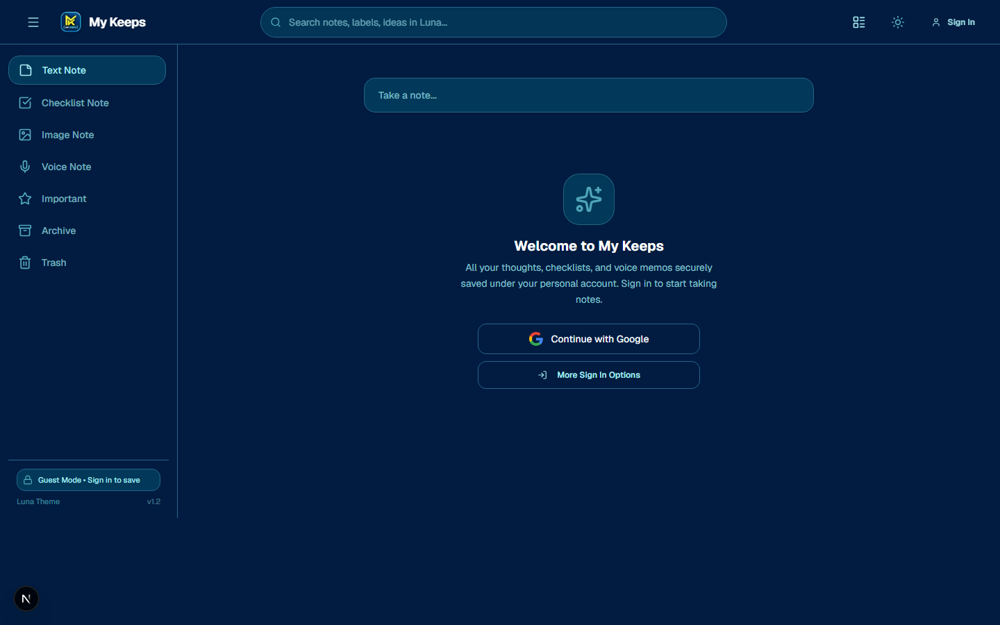

<div align="center">

# 📝 My Keeps

**A Modern, Secure, and Feature-Packed Note-Taking & Brainstorming Workspace**

[](https://nextjs.org/)
[](https://react.dev/)
[](https://www.typescriptlang.org/)
[](https://tailwindcss.com/)
[](https://www.mongodb.com/)
[](https://redis.io/)
[](https://my-keeps-pink.vercel.app)

<br />

### 🌐 [Explore Live Application](https://my-keeps-pink.vercel.app) &nbsp;|&nbsp; 🖥️ [Backend API Server](https://my-keeps-server.onrender.com)

<br />

<!-- Hero Preview Screenshot -->
<p align="center">
  
</p>

</div>

---

## 🌟 Overview

**My Keeps** is a high-performance, responsive, full-featured web application inspired by Google Keep, designed with modern web technologies and elevated by the proprietary **Luna Design System**. Built with **Next.js 16 (Turbopack)**, **TypeScript**, **Tailwind CSS**, **Better Auth**, **MongoDB Atlas**, and **Redis Cloud**, it combines sleek aesthetics with enterprise-grade data isolation, password-protected note locks, interactive checklists, multimedia attachments, real-time synchronization, and **sub-millisecond cache-aside data retrieval**.

---

## 🚀 Key Features

### ⚡ Redis Cloud In-Memory Caching & Zero Auth Flicker (SSR)
- **High-Velocity Cache-Aside Architecture**: Integrates **Redis Cloud** (`ioredis`) for sub-millisecond response times on note queries (`notes:${userId}:${filter}`) and user profiles. Reduces MongoDB load and yields instantaneous page renders.
- **Instant Mutation Invalidation**: Whenever a note is created, updated, pinned, color-coded, locked, or deleted, user-specific Redis cache keys are instantly invalidated (`invalidateUserNotesCache`), guaranteeing 100% data consistency.
- **Zero Auth Flicker**: Server-side session verification and pre-hydration eliminate client-side auth delay. The user avatar and dashboard render synchronously on first paint during SSR, preventing "Sign In" button flashes and skeleton loader jumps.
- **Pre-Cached SSR Hydration**: Note state is pre-populated directly within Server Components (`getServerNotes`), providing instant First Contentful Paint (FCP) and zero Cumulative Layout Shift (CLS).

### 👤 Account Isolation & Multi-Tenant Security
- **Strict Account Isolation**: Every note, checklist, and audio attachment is strictly tied to the authenticated user's account (`userId`). Unauthenticated visitors and guest sessions cannot view, mutate, or leak another user's notes.
- **One-Click Google OAuth & Email Authentication**: Seamlessly powered by **Better Auth**, supporting one-click Google Sign-In as well as secure email and password registration.
- **Interactive Auth Modal**: Non-logged-in visitors can browse the default interface freely; clicking "Take a note..." or quick-action tools triggers a centered, responsive authentication modal without jarring page redirects.

### 🔐 Note Locking & Privacy Protection
- **Custom Password Lock**: Lock any note with a minimum 4-character personal password.
- **Data Masking**: When a note is locked, its text content, checklist items, image attachments, and voice memos are masked in the UI and stripped from standard API payloads until unlocked with the correct password.
- **Atomic Operations**: Locking and unlocking utilize atomic MongoDB update operators (`$set`) to ensure state consistency across refreshes and concurrent sessions.

### 📝 Multi-Format Note Authoring & Google Keep Experience
- **Text Notes**: Clean, responsive, auto-resizing text editor with rich formatting and floating toolbar.
- **Google Keep Style Interactive Checklists**: Inline editing directly beneath the title without extra fluff. Pressing `Enter` instantly creates and autofocuses the next item; `Backspace` cleanly removes empty items. Toggling is strictly isolated to the checkbox, while card body clicks smoothly launch the full edit modal.
- **Image Notes**: Attach and preview screenshots, photos, and diagram images directly inside note cards.
- **Resilient Voice Memos & AI Dictation**: Continuous voice-to-text powered by Web Speech API with automatic restart on speech pauses, cross-browser multi-MIME audio capture, and fallback transcription via Google Gemini AI models.

### 🧭 Smooth Sliding Navigation & Luna UX
- **Smooth Slide-Out Drawer**: Gentle 500ms left-to-right drawer animation with smooth backdrop fade and left arrow (`ArrowLeft`) return button.
- **Desktop & Mobile Responsiveness**: Seamless collapsible sidebar transitions without abrupt DOM mount/unmount flickers.

### 🎨 Luna Design System & Theming
- **Dark Mode by Default**: Engineered with deep oceanic hues (`#011C40`, `#023859`, `#26658C`) accented by luminous turquoise (`#54ACBF`, `#A7EBF2`) to reduce eye strain.
- **Instant Theme Toggle**: Smooth transition between Luna Dark and Clean Light themes with zero flash of unstyled content (FOUC).
- **Custom Color Palette**: Organize notes with curated pastel and deep pastel color themes (Coral, Peach, Sand, Mint, Sage, Fog, Storm, Dusk, Blossom, Clay).

### ⚡ Power Tools & Organization
- **Instant Search**: Real-time filtering across titles, note content, labels, and checklist items.
- **Labels & Tags**: Tag notes with dynamic, categorized tags and filter by specific topics from the sidebar.
- **Pinning & Priority**: Pin vital thoughts to the top of your workspace or mark notes with the Important Star badge.
- **Archive & Soft-Delete Trash**: Keep your workspace clutter-free by archiving inactive notes, or restore deleted notes from the Trash before permanent deletion.
- **Batch Actions**: Multi-select notes to pin, archive, change colors, mark important, or delete in a single click.
- **Grid & List Views**: Toggle instantly between multi-column masonry grids and focused vertical list views.

---

## 🛠️ Technology Stack

| Layer | Technology | Purpose / Description |
|---|---|---|
| **Framework** | **Next.js 16.3.4 (App Router)** | Server and client components, API route handlers, Turbopack builds |
| **Language** | **TypeScript 5.0+** | Strict end-to-end type safety across client, models, and API |
| **Styling** | **Tailwind CSS 3.4** | Utility-first CSS, custom Luna color system, dark mode variants |
| **Authentication** | **Better Auth** | Session management, MongoDB adapter, Google OAuth & email auth |
| **Database** | **MongoDB Atlas & Mongoose** | Cloud NoSQL database with atomic document schemas and indexing |
| **In-Memory Cache** | **Redis Cloud & ioredis** | High-velocity Cache-Aside queries, session caching, and sub-millisecond retrieval |
| **Icons & UI** | **Lucide React** | Clean, lightweight SVG icon suite |
| **Notifications** | **React Hot Toast** | Minimalist, non-intrusive toast notifications |
| **Backend REST API** | **Express.js & TypeScript** | Standalone microservice deployed on Render (`my-keeps-backend`) |
| **Hosting & CI/CD** | **Vercel** | Edge-accelerated frontend & serverless deployment with automated CI/CD |

---

## 📂 Project Architecture

```
my-keeps-frontend/
├── public/
│   ├── images/               # App logos and branding assets
│   └── screenshot.png        # Production application screenshot
├── src/
│   ├── app/
│   │   ├── (dashboard)/      # Dashboard pages (Notes, Checklists, Archive, Trash, etc.)
│   │   ├── api/
│   │   │   ├── auth/         # Better Auth OAuth & credentials handlers
│   │   │   ├── notes/        # Full CRUD, search, Redis cache-aside, and batch actions
│   │   │   │   └── [id]/     # Single note endpoints, /lock, /unlock
│   │   │   ├── upload/       # Cloudinary/S3 media upload API
│   │   │   └── user/         # User profile and avatar management
│   │   ├── login/            # Authentication login page
│   │   ├── register/         # Account registration page
│   │   ├── layout.tsx        # Root HTML layout with SSR session & pre-cached notes hydration
│   │   └── globals.css       # Global styles and Luna CSS variables
│   ├── components/
│   │   ├── auth/             # GoogleAuthButton, AuthPromptModal
│   │   ├── layout/           # Sticky Header (zero auth flicker), Responsive Sidebar, Omnibox search
│   │   ├── notes/            # CreateNoteBar, NoteCard, NoteGrid, LockModal, UnlockModal
│   │   ├── profile/          # ProfileModal with customizable avatar
│   │   ├── providers/        # NotesProvider (global pre-cached state), ThemeProvider
│   │   └── ui/               # Reusable buttons, badges, modals, grips
│   ├── hooks/                # useNotes, useTheme custom React hooks
│   ├── lib/                  # Database connection, auth config, Redis client, upload helpers
│   │   ├── server/           # Server-side data fetchers (getServerNotes)
│   │   ├── redis.ts          # Singleton Redis client and cache-aside helpers
│   ├── models/               # Mongoose schemas (NoteModel)
│   └── types/                # Note, Color, User, and ViewMode TypeScript definitions
```

---

## 📡 REST API Reference

| Method | Endpoint | Description | Auth Required |
|---|---|---|---|
| `GET` | `/api/notes?userId={id}&filter={type}` | Fetch user notes filtered by active, archive, trash, etc. | Yes (`userId`) |
| `POST` | `/api/notes` | Create a new text, checklist, image, or voice note | Yes (`userId`) |
| `PATCH` | `/api/notes/:id` | Update note title, content, color, pin, or archive status | Yes (`userId`) |
| `DELETE` | `/api/notes/:id` | Permanently delete a single note | Yes (`userId`) |
| `DELETE` | `/api/notes?action=empty-trash` | Empty all trashed notes for the user | Yes (`userId`) |
| `DELETE` | `/api/notes` | Batch delete multiple notes by IDs in JSON body | Yes (`userId`) |
| `POST` | `/api/notes/:id/lock` | Lock a note with a minimum 4-character password | Yes |
| `POST` | `/api/notes/:id/unlock` | Verify password to unlock or permanently remove lock | Yes |
| `GET` | `/api/user/profile` | Retrieve user profile details and synced avatar | Yes |

---

## 💻 Local Development Setup

### Prerequisites
- **Node.js**: `v18.18.0` or higher
- **Package Manager**: `npm`, `pnpm`, or `yarn`
- **MongoDB**: A local MongoDB instance or a free [MongoDB Atlas](https://www.mongodb.com/cloud/atlas) cluster URI.
- **Google Cloud Console**: OAuth 2.0 Client ID and Secret (for Google Sign-In).

### 1. Clone the Repository
```bash
git clone https://github.com/Asmual/My-Keeps.git
cd My-Keeps/my-keeps-frontend
```

### 2. Configure Environment Variables
Create a `.env.local` file in the root of `my-keeps-frontend`:

```env
# MongoDB Connection
MONGODB_URI=mongodb+srv://<username>:<password>@cluster.mongodb.net/my_keeps?retryWrites=true&w=majority

# Better Auth Configuration
BETTER_AUTH_SECRET=your-secure-random-32-character-secret
BETTER_AUTH_URL=http://localhost:3000
NEXT_PUBLIC_APP_URL=http://localhost:3000

# Google Social OAuth Provider
GOOGLE_CLIENT_ID=your-google-client-id.apps.googleusercontent.com
GOOGLE_CLIENT_SECRET=your-google-client-secret

# Redis Cloud Caching Configuration
REDIS_URL="redis://default:<password>@<host>:<port>"

# Media Storage (Optional for Cloudinary / AWS S3)
CLOUDINARY_CLOUD_NAME=your_cloud_name
CLOUDINARY_API_KEY=your_api_key
CLOUDINARY_API_SECRET=your_api_secret
```

### 3. Install Dependencies
```bash
npm install
```

### 4. Run Development Server
```bash
npm run dev -- -p 3000
```
Open [http://localhost:3000](http://localhost:3000) in your browser to view the application.

### 5. Build for Production
```bash
npm run build
npm start
```

---

## 🌐 Live Deployments

- **Frontend Application (Vercel)**: [https://my-keeps-pink.vercel.app](https://my-keeps-pink.vercel.app)
- **Backend API Server (Render)**: [https://my-keeps-server.onrender.com](https://my-keeps-server.onrender.com)

---

## 📄 License

This project is licensed under the **MIT License**. Free for personal and commercial usage.

---

<div align="center">
  Crafted with passion using <b>Next.js</b>, <b>TypeScript</b> & <b>Luna Design</b>.
</div>
